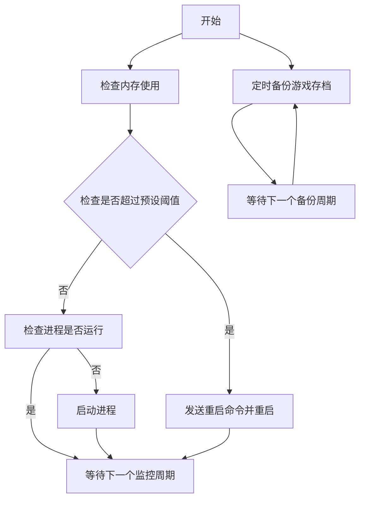

# Palworld-server-protecter
 Palworld服务端进程守护+内存监控+优雅重启
（for windows）

~~希望有人可以帮我加上备份存档功能，懒了。~~  已完成

## 功能
- 内存监控（自定义阈值触发）
- 进程守护（当前如果没有服务端运行就自动重启）
- 优雅重启（内存占用达到阈值后自动发送公告并关服等待重启）
- 自动备份存档

## 使用方法
使用前请先安装nodejs环境

服务端配置文件中RCONEnabled需要设置为True

1.修改`index.ts`中顶部的配置信息，如路径、周期、端口、密码等

2.在目录命令行中运行`npm install`

3.在目录命令行中运行`npm run build`

4.在目录命令行中运行`npm start`

游戏存档备份会保存到/dist/backup中

## 运行逻辑


## 已知问题
1.受服务端限制，rcon发送的文本中无法保留空格

2.受服务端限制，rcon无法发送中文，貌似服务端是gbk编码

3.rcon发送命令后，无法获取响应，但rcon客户端仍然会期待响应，这导致了虽然会报错，但服务端仍会正常接收，不影响实际使用。
```Error sending RCON command: Error: Timeout for packet id 1```RCON超时报错不影响使用
